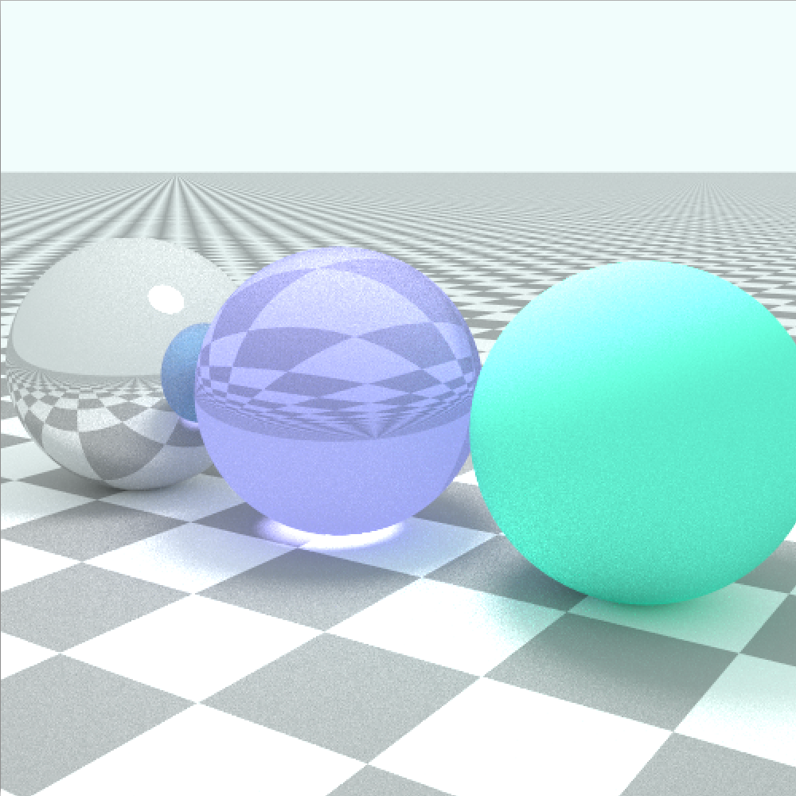
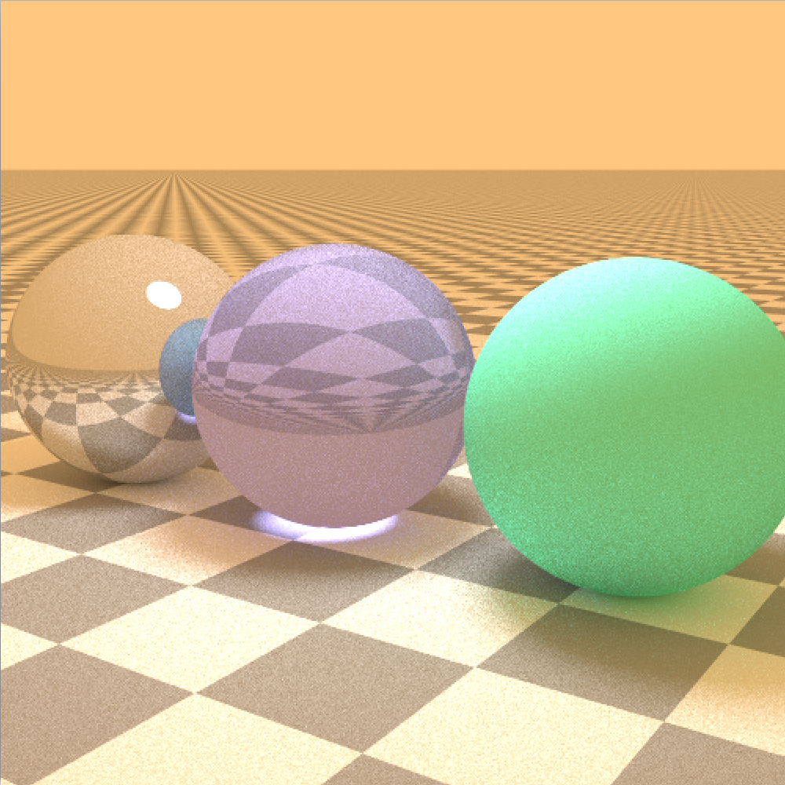
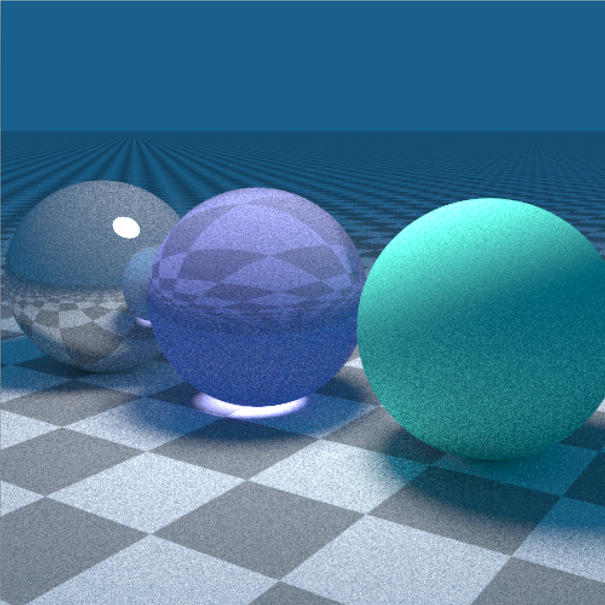
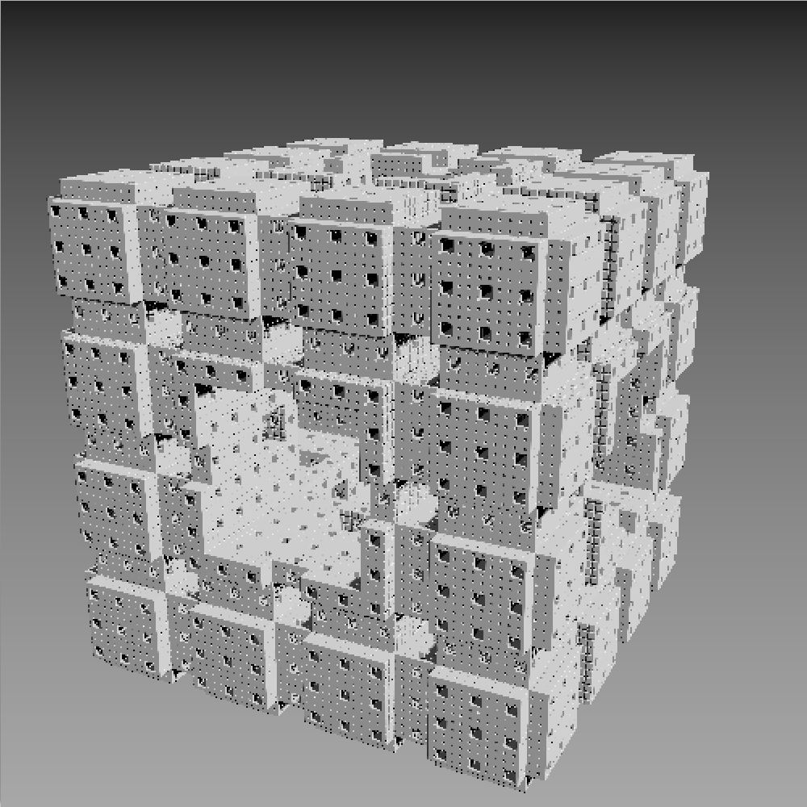
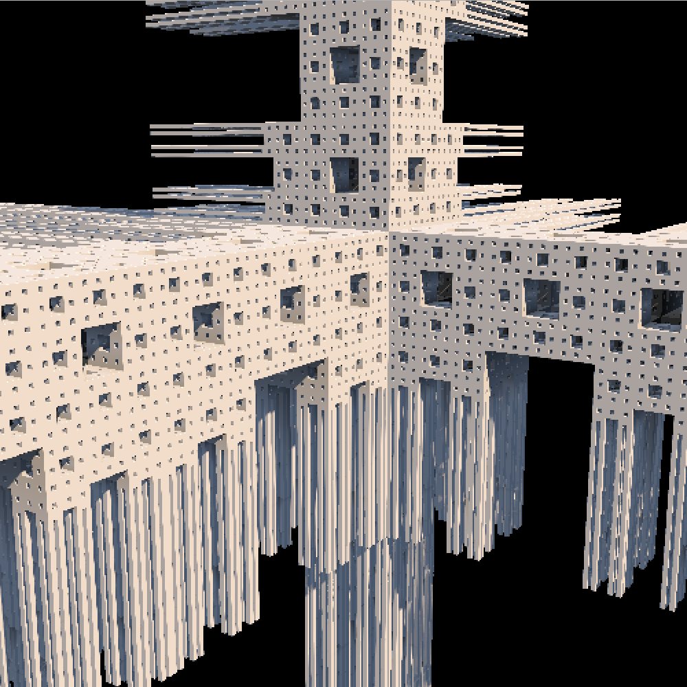

# Raytracing First Touch
このプログラムは大学のプログラミング演習1という授業で作成したものです。  
  



  
  
また、メンガーのスポンジでベクトルに対してのmod関数の実装を下記のようにすると面白い事になったので載せておきます。（本当は各要素に対してスカラのmod関数を実装すればいいだけ）  
```processing
Vector mod(Vector v)
{
    Vector a = this.div(v).floor().mul(v);
    return this.sub(a);
}
```
  
  
## 参考にさせていただいたもの

- [はじめようレイトレーシング](http://raytracing.xyz)
- [inigo quilez (menger)](http://iquilezles.org/www/articles/menger/menger.htm)

## ライセンス